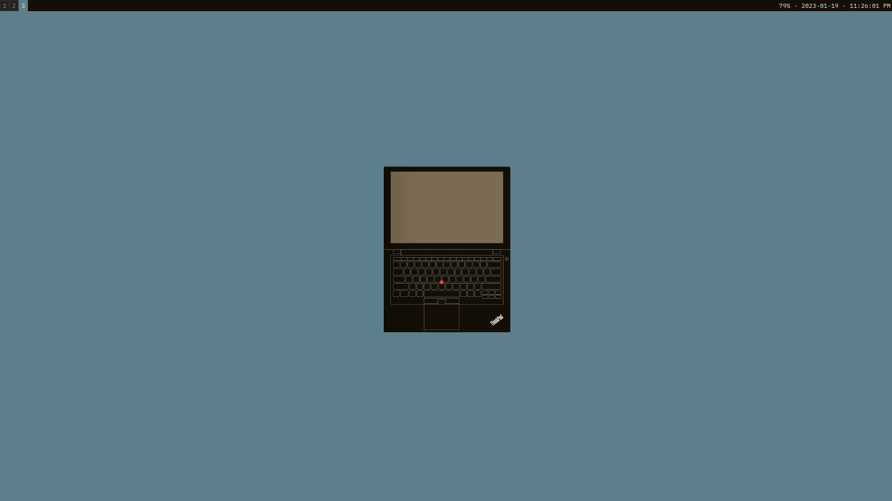
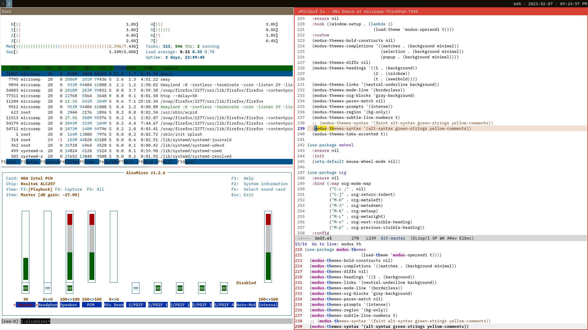

- [dotfiles](#org57d39dd)
  - [Requirements](#org22ab68b)
    - [Misc](#orgcbbc2df)
  - [QuickStart](#org266a307)
  - [Screenshots](#orgedf8df9)


<a id="org57d39dd"></a>

# dotfiles


<a id="org22ab68b"></a>

## Requirements

```sh
lsb_release -a
```

```text
No LSB modules are available.
Distributor ID: Ubuntu
Description:    Ubuntu 22.04.1 LTS
Release:        22.04
Codename:       jammy
```

-   `sway`

    ```sh
    apt install sway swaylock
    ```

-   `emacs`

    ```sh
    sudo snap install emacs --classic

    ```

    ```sh
    mkdir -p ~/.emacs.d/notes
    ```

-   `tmux`

    ```sh
    apt install tmux
    ```

-   `vim`

    ```sh
    apt install vim
    ```

-   `stow`

    ```sh
    apt install stow
    ```


<a id="orgcbbc2df"></a>

### Misc

-   `pandoc`

    ```sh
    apt install pandoc
    ```

-   `ripgrep`

    ```sh
    apt install ripgrep
    ```

-   `fzf`

    ```sh
    apt install fzf
    ```

-   `slurp` and `grim`

    ```sh
    apt install slurp grim
    ```

    (to replace `scrot` from Xorg)

-   `fonts-ibm-plex`

    ```sh
    apt install fonts-ibm-plex
    ```

-   `pfetch`

    [pfetch](https://github.com/dylanaraps/pfetch)

    ```sh
    mkdir -p ~/src/github.com/dylanaraps/pfetch
    git clone https://github.com/dylanaraps/pfetch.git ~/src/github.com/dylanaraps/pfetch
    ln -s ~/src/github.com/dylanaraps/pfetch/pfetch ~/bin/pfetch
    ```

-   `wlsunset`

    [wlsunset](https://sr.ht/~kennylevinsen/wlsunset/)

    e.g.

    ```sh
    wlsunset -l 36.8509 -L 174.7645 & # NZ
    ```

-   `pass`

    ```sh
    apt install pass
    ```

    -   `dmenu-wl`

        TODO: Build from source

    -   `passmenu`

        ```sh
        wget https://git.zx2c4.com/password-store/plain/contrib/dmenu/passmenu
        chmod u+x passmenu
        mv passmenu ~/bin
        which passmenu
        ```

-   `wl-clipboard`

    ```sh
    apt install wl-clipboard
    ```

<a id="org266a307"></a>

## QuickStart

```sh
stow -vv bash -t ~/
stow -vv config -t ~/
stow -vv emacs -t ~/
stow -vv tmux -t ~/
stow -vv vim -t ~/
```


<a id="orgedf8df9"></a>

## Screenshots




